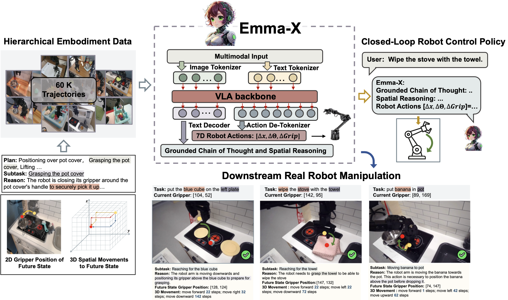

<h1 align="center"> 
Meet Emma-X, an Embodied Multimodal Action Model 
<br/>

</h1>

<div align="center">
  

<br/>

[](https://arxiv.org/abs/2412.11974) [](https://huggingface.co/declare-lab/Emma-X) [](https://declare-lab.github.io/Emma-X/)


</div>



## Getting Started

```python
# Install minimal dependencies (`torch`, `transformers`, `timm`, `tokenizers`, ...)
# > pip install -r https://raw.githubusercontent.com/openvla/openvla/main/requirements-min.txt
from transformers import AutoModelForVision2Seq, AutoProcessor
from PIL import Image

import torch

# Load Emma-X
vla = AutoModelForVision2Seq.from_pretrained(
    "declare-lab/Emma-X",
    attn_implementation="flash_attention_2",  # [Optional] Requires `flash_attn`
    torch_dtype=torch.bfloat16, 
    low_cpu_mem_usage=True, 
    trust_remote_code=True
).to("cuda:0")
processor = AutoProcessor.from_pretrained("declare-lab/Emma-X", trust_remote_code=True)

image: Image.Image = get_from_camera(...)
prompt = "In: What action should the robot take to achieve the instruction\nINSTRUCTION: \n{<Instruction here>}\n\nOut: "

# Predict Action (action is a 7 dimensional vector to control the robot)
inputs = processor(prompt, image).to("cuda:0", dtype=torch.bfloat16)
action, _ = vla.generate_actions(inputs, do_sample=False, max_new_tokens=512)

print("action", action)
# Execute...
robot.act(action, ...)
```

## Installation
1. Save huggingface token to `./.hf_token`
```
echo hf_... >>> .hf_token
```
2. Python environment
```
# Create and activate conda environment
conda create -n openvla python=3.10 -y
conda activate openvla

# Install PyTorch. Below is a sample command to do this, but you should check the following link
# to find installation instructions that are specific to your compute platform:
# https://pytorch.org/get-started/locally/
conda install pytorch torchvision torchaudio pytorch-cuda=12.4 -c pytorch -c nvidia -y  # UPDATE ME!

pip install -r requirements-min.txt

# Install Flash Attention 2 for training (https://github.com/Dao-AILab/flash-attention)
#   =>> If you run into difficulty, try `pip cache remove flash_attn` first
pip install packaging ninja
ninja --version; echo $?  # Verify Ninja --> should return exit code "0"
pip install "flash-attn==2.5.5" --no-build-isolation
```

## Training the Model
3.1 Download base checkpoint
```
# Change directory to your base model checkpoints folder
mkdir base_checkpoints
cd base_checkpoints

# Download checkpoint (30 GB) -- may take a few minutes
git clone git@hf.co:openvla/openvla-7b-prismatic

# If the command above did not download the full checkpoint,
# manually fetch it via git Large File Storage (LFS)
# Note: You may have to configure an SSH key for this to work
cd openvla-7b-prismatic
git lfs fetch --all
```
3.2 Download the dataset  (124 GB)
```
# Change directory to your openvla github folder
cd <github_repo>

# Download the full dataset (124 GB)
wget -r -nH --cut-dirs=4 --reject="index.html*" https://rail.eecs.berkeley.edu/datasets/bridge_release/data/tfds/bridge_dataset/

# Rename the dataset to `bridge_orig` (NOTE: Omitting this step may lead to runtime errors later)
mv bridge_dataset bridge_orig
```

3.3 Download the additional hierarchical dataset with grounded reasoning
```
git clone https://huggingface.co/datasets/declare-lab/Emma-X-GCOT
```
4. Train the model
```bash
torchrun --standalone --nnodes 1 --nproc-per-node <number of gpu> --master_port=29000 vla-scripts/train.py \
    --pretrained_checkpoint /home/emrys/G/openvla-tej/base_checkpoints/openvla-7b-prismatic/checkpoints/step-295000-epoch-40-loss=0.2200.pt \
    --vla.type "prism-dinosiglip-224px+mx-moveonly-moveguided-single-policy" \
    --data_root_dir "path/to/Emma-X-GCOT" \
    --run_root_dir ./Logs \
    --wandb_project <project_id> \
    --wandb_entity <entity_id> \
    --wandb_disable true \
    --is_resume False
```


## Testing with Widowx Robot

Follow this [link](https://github.com/openvla/openvla/tree/1b024f242eda833dc8e321953f25cfd5f3d2f76d?tab=readme-ov-file#bridgedata-v2-widowx-evaluations) to setup the WidowX robot
To run the real robot testing, execute the following command:
```python
python experiments/robot/bridge/run_bridge_eval.py
```

## Generate Grounded CoT Dataset
To generate the Grounded CoT dataset for other datasets, please check [Grounded CoT](./GCOT/README.md)

## Acknowledgements
This codebase is built on top of the [OpenVLA](https://github.com/openvla/openvla/) framework

## Citation
```
@article{sun2024emma,
  title={Emma-X: An Embodied Multimodal Action Model with Grounded Chain of Thought and Look-ahead Spatial Reasoning},
  author={Sun, Qi and Hong, Pengfei and Pala, Tej Deep and Toh, Vernon and Tan, U-Xuan and Ghosal, Deepanway and Poria, Soujanya},
  journal={arXiv preprint arXiv:2412.11974},
  year={2024}
}
```
